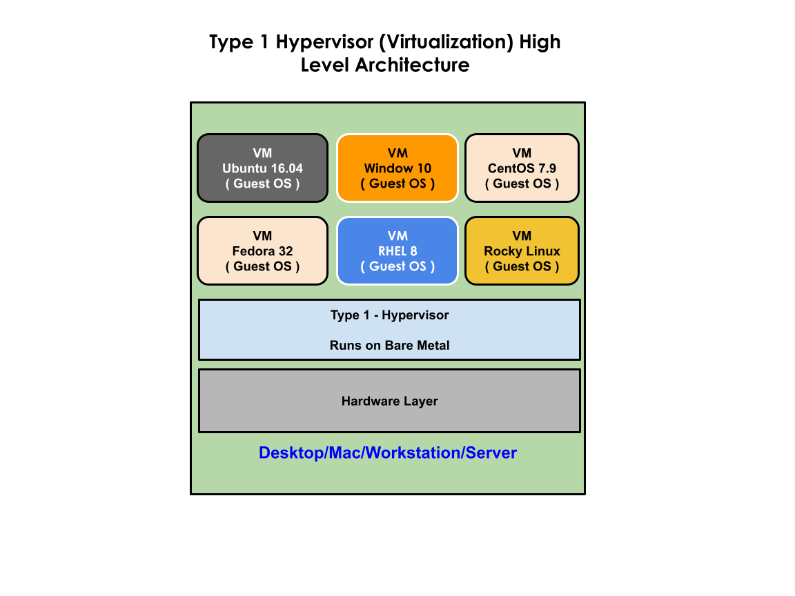
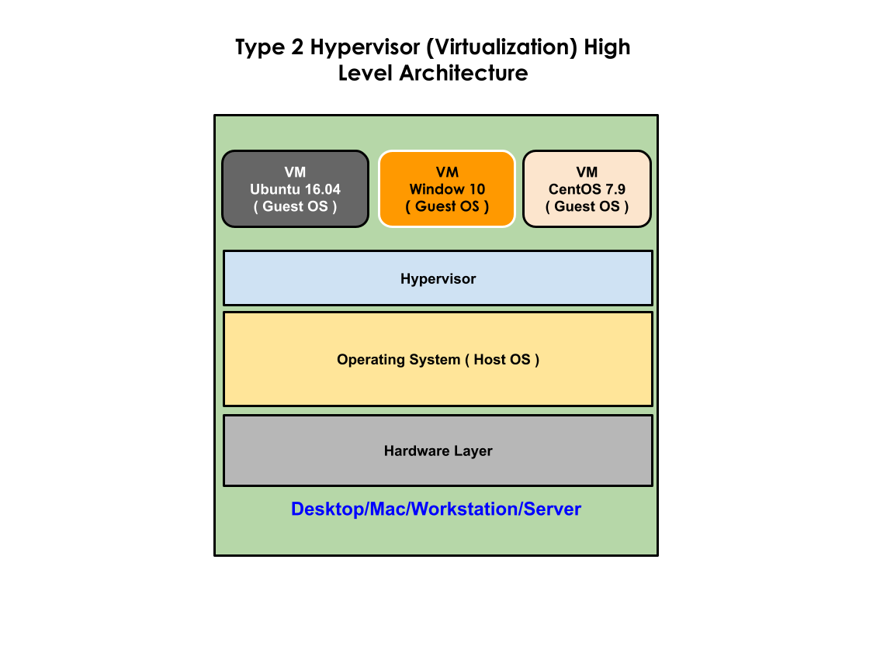

# Day 1 - Docker

## Boot Loaders
- LILO - Opensource
- GRUB ( 1 & 2 ) - opensource
- rEFIt - used by Intel based Macs
- BootCamp - used by Mac OSX to support dual booting
- Linux OS comes with GRUB 2 Boot Loader
- Only one OS can be active at any point
- You can technically install many OS in the same system but only one OS can be active OS at any point in time

## Virtualization Technology
- is also referred as Hypervisor
- this technology helps us run many Operating Systems side by side on the same machine (Laptop/Desktop/Workstation/Server)
- many OS can be active on the same system 
- it is a combination of Hardware & Software technology
  - Processor
    - AMD-V is the virtualization feature supported on the AMD processor
    - VT-X is the virtualization feature supported on the Intel processor
- There are two types of Hypervisors available
  1. Type 1  ( Bare Metal Hypervisors - Servers )
       - doesn't require Host OS
       - it can be directly installed on a bare server
       - https://www.vmware.com/topics/glossary/content/bare-metal-hypervisor.html
  2. Type 2  ( We install on Laptops/Desktops/Workstations )
       - requires HOST OS
       - i.e it can only be installed on top a Host Operating System ( Windows, Mac OS-X, Unix/Linux )
- Without Virtualization Technology 1000 Physical servers are required to support 1000 OS
- Server consolidation is possible with the help of Virtualization Technology.  In other words, technically 1 or 2 Servers can host 1000 Virtual machines in the place of 1000 Physical Servers.  This results in huge cost saving in terms of real estate cost (rental/lease), power bill, air-conditioning, sound proofing, server cost, etc.,
- What is the deciding factor that controls the max Virtual machines supported?
    - configuration of the machine
    - Processors with multi-cores
    - RAM
    - Storage (Hard Disk )
    - High end servers/workstations supports Multiple Sockets(Multiple Processors) in a single motherbaord
    - Some Processors are SCM(Single Chip Module) or MCM(Multiple Chip Modules), meaning one IC(Integrated Chip) supports many processors but can be installed into one socket on the motherboard.
- Hyperthreading
    - each physical cpu cores are seen by the Hypervisor(virtualization) software as 2 or more logical cores
    - 1 physical core will be detected by the virtualization softwares as 2 Logical cores
    - Example
        - let's say you have Processor that supports 256 core
        - it would be seen by the Virtualization software as 512 (256 x 2) logical cores
        - in modern processors each Physical core is detected as 256 x 4 = 1024 logical cores

- In case of Type2 virtualization, there will be two kind of Operating Systems
   1. Host Operating System
   2. Virtual Machine (VM - Guest Operating System )
- In case of Type1 virtualization, there will only one kind of Operating System
   - Virtual Machine ( VM - Guest Operating System )

- Virtualization Software Examples
   Oracle 
      - VirtualBox ( Free ) - Type 2
   VMWare
      - Fusion (Mac OS-X) - Type 2
      - Workstation ( Unix/Linux/Windows ) - Type 2
      - vSphere/VCenter ( Type 1 - Hypervisor )
      - Player ( Free on Windows )
   Parallels
      - Mac OS-X - Type 2 ( Commercial License is required )
   Microsoft
      - Hyper-V ( Type 2 ) ( Comes with Licensed OS )
   
   Kernal Virtual Manager (KVM) - Open source supported in all Linux OS
   
| Type 1 Hypervisor                       | Type 2 Hypervisor                        |
| --------------------------------------- | ---------------------------------------- |
|  |    |
   
## Container Technology
- is fundamentally a Linux technology
- Linux Kernel supports
   1. Namespace ( Isolation )
   2. Control Groups (CGroup) - applying hardware resource quota restrictions
 - LXC ( Lightweight Containership )
    - this was directly using the Linux Kernel Namespace & Control Group to support containers
    - but the commands weren't that user-friendly
    - bit low-level
    - not adapted by the industry that much
 - Docker from Docker Inc organization
     - comes in 2 flavours
       1. Community Edition - Docker CE
       2. Enterpise Edition - Docker EE
 - Containers has its own Network Stack ( 7 OSI Layers )
 - Every containers get its own IP Address ( typically private IP )
 - Every container has a file system 
 - Every container has its own Port range 0 - 65535
 - is not an OS
 - is just an application process that runs in a separate namespace
 - technically we can create containers directly using the system calls ( Linux namespace & CGroups )
 - but using Docker Container Engine it is more easier to create containers without knowing any low-level OS/kernel details it is easy to create containers with Docker or similar container softwares

## Container Engine
- a high-level tool that can support managing Container Images and Containers with the help of many other tools
- is capable of managing containers with the help of Container Runtimes
- Docker is a container Engine that depends on runc container runtime to manage containers

## Container Runtime
- is the tool that is capable of managing containers
   - creates containers
   - start/stop/restart/kill/abort containers
- they don't know how to build image or manage container images
- example:
  - runc is a container runtime that is used by many Container Engines including Docker

## Docker Overview
- developed by Docker Inc organization using Go programming language

# Docker Alternatives
- LXC
- Podman
- Rkt ( pronounced as Rocket )

## Docker Image
- official definition 
  - An image is a read-only template with instructions for creating a Docker container. 
  - Often, an image is based on another image, with some additional customization
  - You might create your own images or you might only use those created by others and published in a registry. 
  - To build your own image, you create a Dockerfile
- containers can be created only via Docker Image
- any software that you want on the container level are generally pre-installed in the Docker Image
- Docker Image will not have OS Kernel
- Docker Image will have a package manager like apt(apt-get) if it is a Ubuntu Docker Image
- Docker Image will have a yum package manager if it is a CentOS Docker Image but still will not have Linux kernel.

## Docker Container
- A container is a runnable instance of an image
- Docker containers are created using the Docker Image
- Many containers can be created from a single Docker Image
- get's an IP address
- containers get's its file system from the Docker Image
- get's its own copy of network stack
- get's its own ports ( 0 - 65535 )

## Docker Public/Remote Registry
- Public Docker Registry is a web portal maintained by Docker Inc (Docker Hub)
- hosts a lot of Docker images
- any images you push here are accessible to entire open source community

## Docker Private Registry
- Optionally your organization can setup a private docker registry
- will host many public images and private proprietary Docker images
- JFrog Artifactory or Sonatype Nexus can be used to setup a Private Docker Registry
    - production grade
- optionally can also use docker.io/registry:latest docker image to setup private docker registry
  - good for prototype
  - lightweight setup - very helpful for laptops
  - not recommended for production

## Docker Local Registry
- this is local folder created and maintained by Docker Engine ( Docker Server )

## Docker Architecture


## Recommended articles for further reading
<pre>
https://medium.com/@jegan_50867/docker-overview-be840f727b3

https://docs.microsoft.com/en-us/virtualization/windowscontainers/manage-containers/hyperv-container

</pre>

## Finding the docker version
```
docker --version
```

## Listing Docker Images in the Local Docker Registry
```
docker images
```

## Downloading an image from Docker Hub to Local Docker Registry
```
docker pull alpine:latest
```

## Deleting an Docker Image from Local Registry
```
docker rmi ubuntu:20.04
```

## Creating a container in the interactive(foreground) mode
This command will take you inside the container's shell interactively
```
docker run -it --name c1 --hostname c1 alpine:latest /bin/sh
```
In order to come out of the container's shell, you need to type exit.  This will exit the container.

## Creating a container in the daemon/deattached(background) mode
```
docker run -dit --name c1 --hostname c1 alpine:latest /bin/sh
```

## Listing all running containers
```
docker ps
```

## Getting inside conainter shell
```
docker exec -it <container-id> /bin/bash
docker exec -it <container-name> /bin/bash
docker exec -it <container-name> bash
```

## Stop a running container
```
docker stop <container_id>
docker stop <container_name>
```

## Restart a running container
```
docker restart <container_id>
docker restart <container_name>
```

## Start a stopped container
```
docker start <container_id>
docker start <container_name>
```

## Delete a container
```
docker rm <container_id>
docker rm <container_name>
```
## Deleting multiple containers
```
docker rm <container_id1> <container_id2> <container_id3>
docker rm <container_name1> <container_name2> <container_name3>
docker rm $(docker ps -aq)
```

## Stopping and deleting multiple containers
```
docker stop $(docker ps -q) && docker rm $(docker ps -aq)
```

## Renaming a container
Recommended practice is to use only lowercase while naming containers.
```
docker rename <old-container-name> <new-container-name>
```

## Finding IP address of a running container
```
docker inspect <container-id>
docker inspect <container-id> | grep IPA
docker inspect <container-name> | grep IPA
docker inspect -f {{.NetworkSettings.IPAddress}} <container-name>
```

## Committing a container as a Docker image
You may manually install some software tools and may commit it as a container image.

Though this works, from DevOps point of view this isn't recommended.

```
docker commit <container-id> <image-name:tag>
docker commit <container-name> <image-name:tag.
docker commit ubuntu1 tektutor/ubuntu-vim:1.0
```

## Storing application data in an external volume as opposed to container storage
- Storing application data in a container storage is considered a bad practice
- Container orchestration platform in the process scale up/down it might delete any container, hence you
  will lose the data stored in container storage
- the recommended practice is to store application log/data in an external volume ( hostpath, AWS S3, Block storage provided by your cloud vendor, etc.,)

First create a folder in your home directory.
```
mkdir -p ~/tmp/tomcat
```
Create a html file
```
echo "Tomcat Works!" > ~/tmp/tomcat/index.html
```

Let's create a container
```
docker run -d --name tomcat1 --hostname tomcat1 -v ~/tmp/tomcat:/usr/local/tomcat/webapps/tektutor tomcat:latest
```

Find the IP address of your container
```
docker inspect tomcat1| grep IPA
```

Test and see if you can access the web page hosted inside the container
```
curl <container-ip>:8080/tektutor/index.html
```

Expected ouptut
<pre>
Tomcat Works!
</pre>

## Copying a file from your hos/etc/nginxt system path to container
```
docker cp file-name-in-your-local-system <container-name>:<container-absolute-path>
```

## Copying a file from the container to your local machine current directory
```
docker cp <container-name>:<container-absolute-path>/<file-name> .
```

## Building custom Docker image using a Dockerfile

Let's create a custom Dockerfile which installs vim, jdk and maven on top of ubuntu:16.04 image
```
FROM ubuntu:16.04
MAINTAINER <your-name> <your-email-id>

RUN apt-get update && apt-get install -y vim default-jdk
RUN apt-get install -y maven
```
Save the above code in a file named Dockerfile.  Dockerfile is the standard file name Docker expects.

You may proceed witht the image build as shown below
```
docker build -t <your-organization-name>/<os-name>-<tools-supported>:<version> <dockerfile-dir>
docker build -t tektutor/ubuntu-maven:1.0 .
```

Alternatively, you could also name the Dockerfile with a custom name, let's say my-docker-file.
In that case, the build command will look as shown below
```/etc/nginx
docker build -f ./my-docker-file -t tekutor/ubuntu-maven:1.0 .
```

You may check the custom build image with the below command
```
docker images
```

You may create a new container and test if the tools installed are working as exepcted
```
docker run -dit --name c1 --hostname c1 tektutor/ubuntu-maven:1.0 /bin/bash
```

You can get inside the container as shown below
```
docker exec -it c1 /bin/bash
```

Within the container shell prompt, you may try the below commands
```
javac -version
java -version
mvn --version
```

## Things to consider while choosing your base image
- the size of base image should be kept smaller as much as possible
- from that point of view busybox or alpine images are ideal candidates to be used as a base image

The same jdk8 and maven can be installed using an alpine image as shown below

Dockerfile - maven-alpine-dockerfile
```
FROM alpine:latest

RUN apk add openjdk8
RUN apk add maven
```

You may now buid the custom image as shown below
```
docker build -f ./maven-alpine-dockerfile tektutor/alpine-maven:1.0 .
```

When you list the images, notice the size of tektutor/alpine-maven:1.0 and tektutor/ubuntu-maven:1.0.  In my case
I noticed the tektutor/alpine-maven:1.0 image was atleast smaller by 420 MB.

Hence using busybox or alpine as a base image is a recommended practice.

## Port forward to expose a container service to outside world

Let's create a load balancer container
```
docker run -d --name lb --hostname lb -p 80:80 nginx:latest
```

Let's create 3 nginx web server containers
```
docker run -d --name web1 --name web1 nginx:latest
docker run -d --name web2 --name web2 nginx:latest
docker run -d --name web3 --name web3 nginx:latest
```

List and check if 4 containers that we created above are running
```
docker ps
```

We need to configure the lb container to work like a load balancer as nginx works by default as a web server.

Let's copy the nginx.conf file from lb container to local machine to configure it
```
docker cp lb:/etc/nginx/nginx.conf .
```

Let's edit the nginx.conf copied from the container on the local machine. After configuration the file should
appear like below
<pre>
user  nginx;
worker_processes  auto;

error_log  /var/log/nginx/error.log notice;
pid        /var/run/nginx.pid;


events {
    worker_connections  1024;
}

http {
    upstream backend {
        server 172.17.0.3:80;
        server 172.17.0.4:80;
        server 172.17.0.5:80;
    }
    
    server {
        location / {
            proxy_pass http://backend;
        }
    }
}
</pre>

In the config file above, 172.17.0.3 is the IP address of my web1 container, 172.17.0.4 is the IP address of web2 container and 172.17.0.5 is the web3 container IP address.  You need to find your web<x> container IPs and update accordingly.

We need to copy the above nginx.conf file from your local machine to the lb container as shown below
```
docker cp nginx.conf lb:/etc/nginx/nginx.conf
docker restart lb
```
  
Let's customize the index.html file on each of the web1, web2 and web3 containers as shown below from your local machine.

```
echo "Server 1" > index.html
docker cp index.html web1:/usr/share/nginx/html/index.html
  
echo "Server 2" > index.html
docker cp index.html web2:/usr/share/nginx/html/index.html
  
echo "Server 3" > index.html
docker cp index.html web3:/usr/share/nginx/html/index.html
```

Now let's test if we can access the loadbalancer as shown below
```
curl localhost
```
Each time you try the above, you are expected to see "Server 1", "Server 2" and "Server 3" in a round-robin fashion.
You may as well try this on a web browser from the lab machine.

You may also try accessing the web page from the windows lab machine using the IP address of your centos server.
