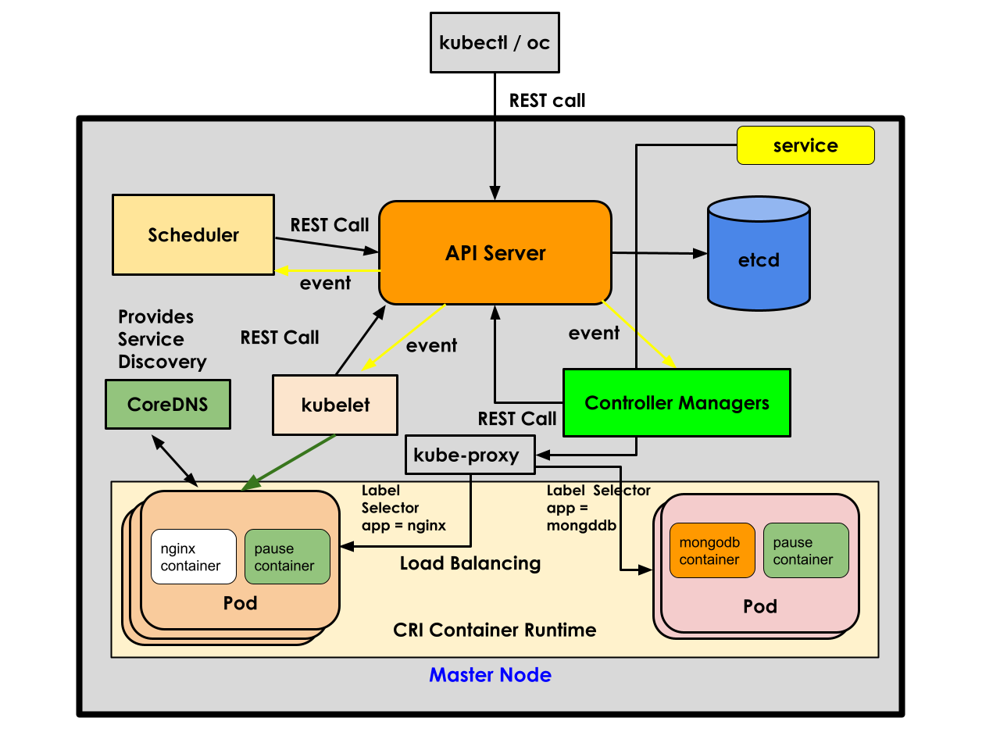

# Day 2 - OpenShift

## Container Orchestration Platform
- manages containers
- provides an environment for applications that guarantees High Availability (HA)
- supports in-built monitoring features
- support self-healing when our application goes unresponsive
- supports scaling up/down our microservice/applications
- supports rolling update
    - upgrading your live application from one version to other without downtime
- supports rollback in case the newly rolled out application version is found to be unstable
- load balances the application pods behind services
- RBAC(Role Based Access Control)
- products 
    - Docker SWARM ( supports only Docker Container Engine )
    - Google Kubernetes ( supports many types of Container Engines including Docker)
    - RedHat OpenShift ( is developed on top of Kubernetes, supports CRI-O container runtime & Podman container engine)
    - Rancher Kubernetes ( GUI for Kubernetes )
    - AWS EKS - Managed Kubernetes Service from Amazon
    - Azure AKS - Managed Kubernetes Service from Azure
    - AWS ROSA - Managed RedHat OpenShift from Amazon
    - Azure OpenShift - Managed RedHat OpenShift from Azure

On-premise(on-prem) datacenters
- datacenter
   - a single datacenter has several thousands of servers in a particular region
   - each Bank may have 100s of such datacenters in different regions and cross-geo locations

Private Cloud
  - VMWare vCenter
  - OpenStack
  - is AWS/Azure like features supported within in an Organization from the datacenters
    owned by your organization

Public Cloud
  - AWS
  - Azure
  - GCP
  - Digital Ocean
    
Hybrid Cloud
  - Partly some servers comes from your privately owned Datacenters
  - Partly some servers comes from Amazon AWS
  - Partly some servers comes from Microsoft Azure

Services offered by Cloud Vendors
- Infrastructure as a Service (IaaS)
    - Here we rent a Hardware
    - Pay as you go - pay only for the time we used the hardware(server)
    - Let's say we used AWS S3, we only pay for how much time we used the particular
      amount of Storage
    - We need to bring the Operating System License
    - Installing OS, performing Security patches on the OS is your organization's responsibility
    - The cloud vendor is only responsible for the HA of the H/W
    - Taking backup, upgrading OS is your organization's responsibility
    - For example
      - ec2 instances (Virtual Machines)
      - many ec2 instances can be created from a single Physical Server
      - it is technically possible that many companies would have created ec2 instances
        on the same shared server
    - ec2 level security is assured by AWS
    - OS/software/your application security is your organization's responsibility
    - Network/Internet services are provided by AWS as part of the plan
    - For every of ec2 instances you create, by default some amount of storage also
      are supported, but you could customize and choose different type of storage and size of storage 
- Platform as a Service (PaaS)
  - HW + OS the cloud vendors offers on pay as you go model
  - We just need to bring the softwares that needs to installed on top of the OS
  - Software back is still our responsibility
  - HW + OS HA is taken care by cloud vendor
  - cloud vendor is responsible for security patch, updates, etc.,
  - securing the OS is the responsibility of cloud vendor
- Software as a Service (SaaS)
  - HW + OS + Application is managed by cloud vendor
  - we will given access to the application
  - we just need to feed the application data and focus on our project
  - Backup, recovery, security is all taken care by cloud vendor

## Kubernetes Overview
- Google developed this Container Orchestration Platform using Go programming language
- Google used this orchestration platform internally for several years
- opensource product
- no support, only community level support is there without any SLA
- it is a time tested platform
- it supports loadbalancers, services, High Availibility, scaling up/down, rolling updates, etc
- Kubernetes supports many types of built-in resources
   - Deployment
   - ReplicaSet
   - Pod
   - Services
       - ClusterIP Service ( Internal - are accessible only within the cluster)
       - NodePort Service (External - are accessible outside the cluster )
       - LoadBalancer Service (External - meant for cloud environments like AWS/Azure, etc.,)
   - Job
   - Ingress
   - IngressController
- Appilcations are deployed in Kubernetes as Deployment
- Deployment has one or more ReplicaSets
- Each ReplicaSet manages one or more Pods
- Each ReplicaSet represents a single version of the application
- Pod is a collection of related containers
- the smallest unit that can be deployed in a Kubernetes is a Pod
- In Kubernetes IP address is assigned only on the Pod level ( In docker, each container gets a IP Address).
  In a Pod, there can be many containers running, all the containers within the same Pod shares the same IP.
- Kubernetes allows us adding our own custom resources(CR) by creating a CustomResourceDefinition (CRD) yaml file
- Using CRDs, one can extend the Kubernetes API ( features )
- CRDs just add more types of Resources into the Kubernetes Cluster, but we also need to deploy custom Controllers
  to manage our Custom Resources
  
## Kubernetes High-Level Architecture

  
## Kubernetes Labels
  - key/value pair
  - eg: app=nginx
  - labels can assigned to kind of resource in Kubernetes
  - the use of labels
  - Deployment identifies the Replicaset by using labels

## Deployment
   - will select the replicaset
   - kubectl get replicasets -l app=nginx
   - Deployment manages ReplicaSet

## Replicaset
   - will select the Pods based on some matching labels
   - ReplicaSet manages Pod
   - kubectl get pods -l app=nginx

## RedHat OpenShift
- is RedHat's distribution of Kubernetes
- is developed on top of Kubernetes
- Using Kubernetes CRDs and Custom Controllers, RedHat added several useful features on top of Kubernetes
- OpenShift is nothing but Kubernetes + additional CRs and addition Controllers
- OpenShift supports Private Container Registry within the OpenShift out of the box
- OpenShift suppports CI/CD within OpenShift cluster
- Openshift supports user management based on RBAC out of the box
- Applications can be deployed from
   - source code (S2I - Source to Image)
   - a Dockerfile
   - container image
   - imperatively and declaratively

## OpenShift High Level Architecture

#### High Level Architecture


#### Master Node



## Tekton K-native CI/CD Framework
- a Framework that works within Kubernetes/OpenShift
- Tekton adds its own CRs and Custom Controllers on top of Kubernetes/OpenShift to support CI/CD with the Orchestration platform cluster
- it is a serverless unline Jenkins CI/CD

## RedHat OpenShift Architecture

[!OpenShift Architecture]()

## OpenShift CLI commands

### Creating a project from command line
In OpenShift, applications are deployed within a project namespace.  Technically, project is nothing but namespace.
Different teams can create their own project and isolate their application deployments from others.

```
oc new-project <your-name>
oc new-project jegan
```
Expected output
<pre>
(jegan@tektutor.org)$ <b>oc new-project jegan</b>
Now using project "jegan" on server "https://api.ocp.tektutor.org:6443".

You can add applications to this project with the 'new-app' command. For example, try:

    oc new-app rails-postgresql-example

to build a new example application in Ruby. Or use kubectl to deploy a simple Kubernetes application:

    kubectl create deployment hello-node --image=k8s.gcr.io/e2e-test-images/agnhost:2.33 -- /agnhost serve-hostname
</pre>

### Deploying an application within a project

Check your project
```
oc project
```

You can deploy nginx as shown below
```
oc create deploy nginx --image=nginx:latest
```

Expected output
<pre>
(jegan@tektutor.org)$ <b>oc create deploy nginx --image=nginx:latest</b>
deployment.apps/nginx created
</pre>


### Listing the deployments
```
oc get deployments
oc get deployment
oc get deploy
```

Expected output
<pre>
(jegan@tektutor.org)$ <b>oc get deployments</b>
NAME    READY   UP-TO-DATE   AVAILABLE   AGE
nginx   0/1     1            0           2m25s
</pre>

### Listing the replicases
```
oc get replicasets
oc get replicaset
oc get rs
```

Expected output
<pre>
(jegan@tektutor.org)$ <b>oc get replicasets</b>
NAME               DESIRED   CURRENT   READY   AGE
nginx-7c658794b9   1         1         0       4m22s
(jegan@tektutor.org)$ <b>oc get replicaset</b>
NAME               DESIRED   CURRENT   READY   AGE
nginx-7c658794b9   1         1         0       4m31s
(jegan@tektutor.org)$ <b>oc get rs</b>
NAME               DESIRED   CURRENT   READY   AGE
nginx-7c658794b9   1         1         0       4m38s
</pre>

### Listing pods
```
oc get pods
oc get pod
oc get po
```

Expected output is
<pre>
(jegan@tektutor.org)$ <b>oc get pods</b>
NAME                     READY   STATUS             RESTARTS       AGE
nginx-7c658794b9-2wmmx   0/1     CrashLoopBackOff   5 (106s ago)   5m31s
(jegan@tektutor.org)$ oc get pod
NAME                     READY   STATUS             RESTARTS       AGE
nginx-7c658794b9-2wmmx   0/1     CrashLoopBackOff   5 (108s ago)   5m33s
(jegan@tektutor.org)$ oc get po
NAME                     READY   STATUS             RESTARTS       AGE
nginx-7c658794b9-2wmmx   0/1     CrashLoopBackOff   5 (111s ago)   5m36s
</pre>

### Deleting a deployment
```
oc delete deploy/nginx
```

Expected output
<pre>
(jegan@tektutor.org)$ <b>oc delete deploy/nginx</b>
deployment.apps "nginx" deleted
</pre>


### Let's redeploy the nginx deployment with bitnami/nginx image
```
oc create deploy nginx --image=bitnami/nginx:lates
```

### List the deployment, replicaset and pods in a single command
```
oc get deploy,rs,po
```

### Scaling up the nginx deployment
```
oc scale deploy/nginx --replicas=3
```

### Scaling down the nginx deployment
```
oc scale deploy/nginx --replicas=1
```

### Creating an external NodePort service for nginx deployment
```
oc expose deploy/nginx --type=NodePort --port=8080
```
Expected output
<pre>
(jegan@tektutor.org)$ <b>oc expose deploy nginx --type=NodePort --port=8080</b>
service/nginx exposed
</pre>

### Listing the services
```
oc get services
oc get service
oc get svc
```

Expected ouptut
<pre>
(jegan@tektutor.org)$ <b>oc expose deploy nginx --type=NodePort --port=8080</b>
service/nginx exposed
(jegan@tektutor.org)$ <b>oc get services</b>
NAME    TYPE       CLUSTER-IP       EXTERNAL-IP   PORT(S)          AGE
nginx   NodePort   172.30.152.102   <none>        8080:30316/TCP   6s
(jegan@tektutor.org)$ <b>oc get service</b>
NAME    TYPE       CLUSTER-IP       EXTERNAL-IP   PORT(S)          AGE
nginx   NodePort   172.30.152.102   <none>        8080:30316/TCP   8s
(jegan@tektutor.org)$ <b>oc get svc</b>
NAME    TYPE       CLUSTER-IP       EXTERNAL-IP   PORT(S)          AGE
nginx   NodePort   172.30.152.102   <none>        8080:30316/TCP   11s
</pre>
